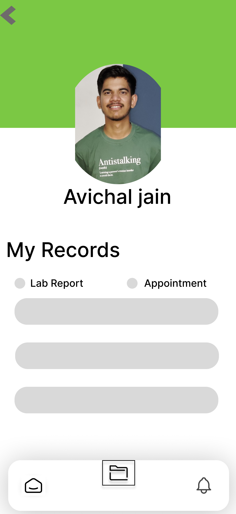

# CureTrack - Integrated Hospital Capacity Management System

CureTrack is an Android application developed in Java using Android Studio. It allows users to search for hospitals, check availability, upload images using Cloudinary, and interact via a chat interface.
It also includes user profiles, location-based search, and navigation between core features using a bottom navigation bar.

## Features

### 🔍 Hospital Search
- View nearby hospitals with bed availability.
- Integrated search functionality.
- Clickable hospital images for more details.

### 📍 Location Awareness
- Displays the user's city/location (e.g., "Bhopal").
- Uses image icons for location indication.

### ☁️ Image Upload with Cloudinary
- Select images from gallery.
- Upload images to Cloudinary.
- View uploaded image URL in log for access and verification.

### 👤 User Profile
- Users can view and edit their profiles.
- Data is stored and retrieved from Firebase Realtime Database.

### 🧭 Bottom Navigation
- Three main tabs: Home, Record (Search), and Profile (Notifications).
- Navigation implemented using `BottomNavigationView`.

### 💬 Chat Feature
- Chat with other users.
- Create and manage chat groups.
- Firebase Realtime Database and Firebase Storage used for chat messages and media attachments.

## Screens & Fragments

- **HomeFragment**: Displays hospitals and image buttons.
- **RecordFragment**: Search bar for hospitals.
- **NotificationFragment**: Placeholder for profile or notifications.
- **PatienthomeFragment**: Displays list and image buttons for hospitals, integrated with fragment lifecycle methods.

## Firebase Integration

- Firebase Authentication for sign-up/login.
- Firebase Realtime Database for storing hospital, chat, and user data.
- Firebase Storage for attachments (images, documents, audio, etc.).

## Cloudinary Integration

- Image uploads are handled via Cloudinary's Java SDK.
- Configuration requires cloud name, API key, and API secret.
- Uploaded image URL is accessible via the log.

### Screnshots 
<p align="center">



  
 


</p>

### 🛠️ Installation Steps for Android Studio
Follow these steps to set up and run this Android project locally:

**1. 📥 Install Android Studio**
Download and install Android Studio from the official website:
👉 https://developer.android.com/studio

**2. 🚀 Clone the Project**
bash
Copy
Edit
git clone https://github.com/your-username/your-repo-name.git

**3. 📂 Open the Project in Android Studio**
Launch Android Studio.

Click File > Open and select the cloned project folder.

**4. 📦 Install Dependencies**
Android Studio will automatically sync and install Gradle dependencies.

If prompted, click "Sync Now".

**5. 📱 Set Up an Emulator or Connect a Device**
Go to Tools > Device Manager and create a virtual device (emulator),
or connect a physical Android device with USB debugging enabled.

**6. ▶️ Run the App**
Click the green "Run" button or use Shift + F10 to build and run the app on the selected device.


### Example Cloudinary Config:
```java
Map<String, String> config = new HashMap<>();
config.put("cloud_name", "cloud_name");
config.put("api_key", "api_key");
config.put("api_secret", "api_secret");
